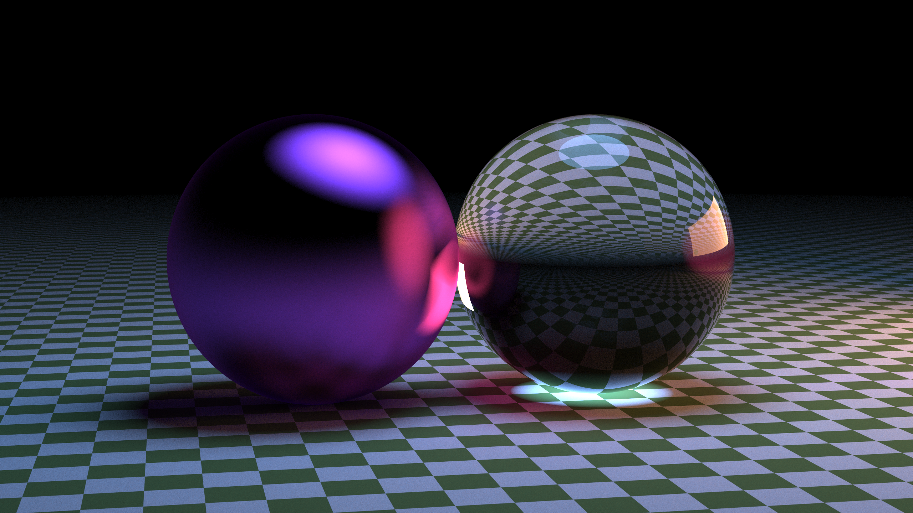
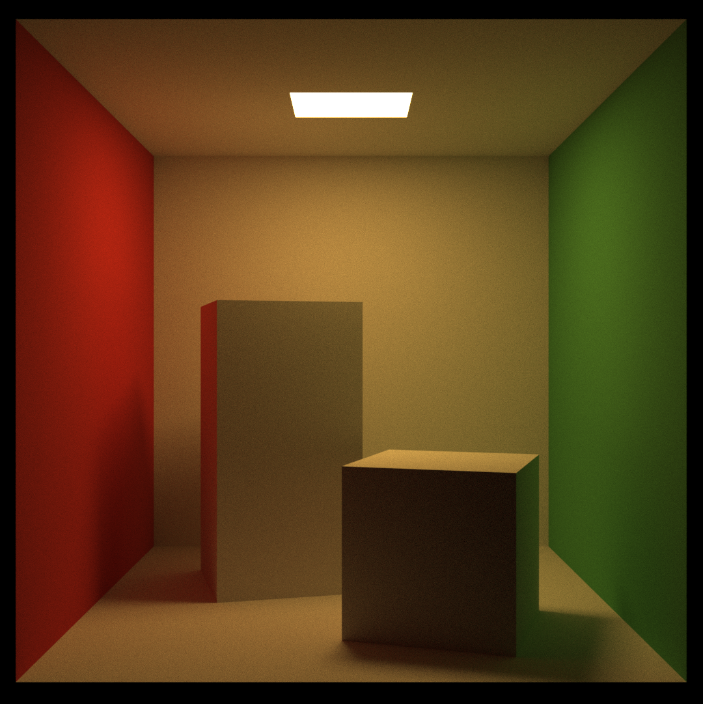

# SerialCppRaytracer

Serial CPP Raytracer for CSE701

## Summary

This is a C++ header engine for serial ray tracing, written as a requirement for the final project of CSE 701 at McMaster University.

## Build Instructions

```bash
g++ -O2 main.cpp -I include
```

Alternatively using cmake:

```bash
mkdir build/
cd build/
cmake ..
make
```

## Run Instructions

Just run the compiled program, and feed the results into a .ppm file:

`./a.out > out.ppm`

There are config files in config/ that can be passed into the compiled program. This allows the user to change rendering settings without having to recompile the program.

`./a.out high.rt > out.ppm`

## Sample Renderings

Glass and metal spheres with rectangular and spherical light
Resolution: 2560 x 1440, samples: 1k


Standard Cornell Box at 1k Resolution with 10k Samples per pixel

